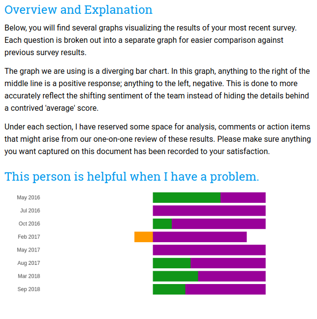
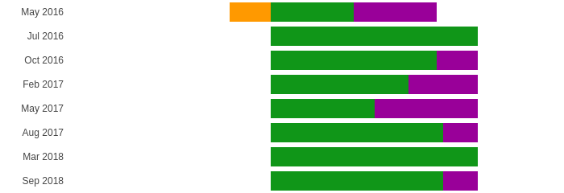

# surveydoc

I manage a team of developers. Periodically, we send out surveys asking
team members to provide feedback on each other's performance and adherence
to company cultural values. Once everyone has responded, I collect these
results and generate a Google Doc so we can review the results.

This process has largely been manual and is time consuming. Hence, this
python script which will read results from a Google Sheet and generate
the appropriate Google Doc.



## Getting Started

In order to use this script, you need a couple of things.

1. You must create a project in your Google Admin console that has access
to Google Drive, Google Doc and Google Sheets.
2. Download the credentials.json file to your local machine for later
reference.
3. Configure the config.json file (using config.json.sample as an example)
4. Create an S3 bucket for temporary file storage (make sure your default
profile has write access to this bucket).

### Installation

Create a virtualenv and install the required dependencies from the
requirements.txt file.

```
python -m venv .env
. .env/bin/activate
pip install -e .
yarn install
surveydoc
```

### config.json

Use the config.json.sample file as an example of the expected format for
your own config.json file. An explanation of the keys follows:

* subjects.name - The name used when generating the Google Doc title and
file name
* subjects.spreadsheet.id - The ID of the spreadsheet to pull survey data
from
* subjects.spreadsheet.sheet - Which sheet within the Google Sheet contains
the data to be used when generating the resulting doc.
* subjects.spreadsheet.range - A simple A1:N style range within the above
specified sheet.
* subjects.drive-folder - The folder location in Google Drive where the
final file should be stored
* subjects.response-map - The name of the key within the response-map object
that is used to map data columns to formatting methods (see below)
* s3.bucket - The bucket to store temporary files. Google Docs needs a publicly
accessible URL for all files embedded within the Google Doc.
* s3.directory - The directory within the bucket used to store files.
* response-map - An object that matches columns from the Google sheet to
ways of formatting the data. This is done in case different subjects have
different survey formats. If a column should not be included in the generated
report, omit it's index from this map. NOTE: This is 0 indexed.

#### Formatters

Currently, this script only supports two methods of formatting responses
-- DivergentBarChart and TextSummary.

The TextSummary will take the last set of responses, filter out empty
answers, and format the rest as a bulleted list.

The DivergentBarChart option will generate [a divergent bar chart](https://peltiertech.com/diverging-stacked-bar-charts/),
as shown below.



#### Google Sheet Data Format

There are two assumptions this script is making about the format of the
survey responses in the Google Sheet.

1. Any data used for the DivergentBarChart is assumed to be numeric and
in the range of 1-4
2. The first column is expected to be labeled "Timestamp" and should be
in the format February 2019.

## License

This project is licensed under the MIT License - see the [LICENSE](LICENSE)
file for details


